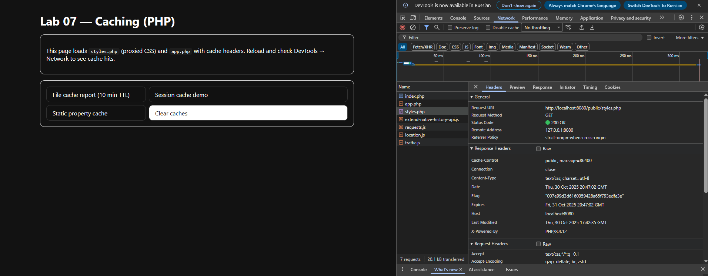
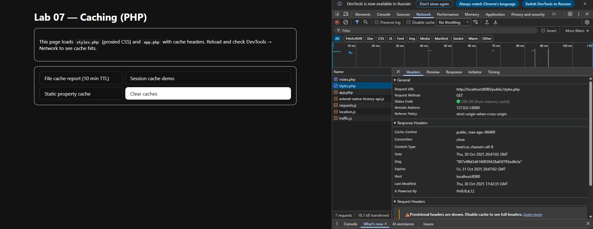
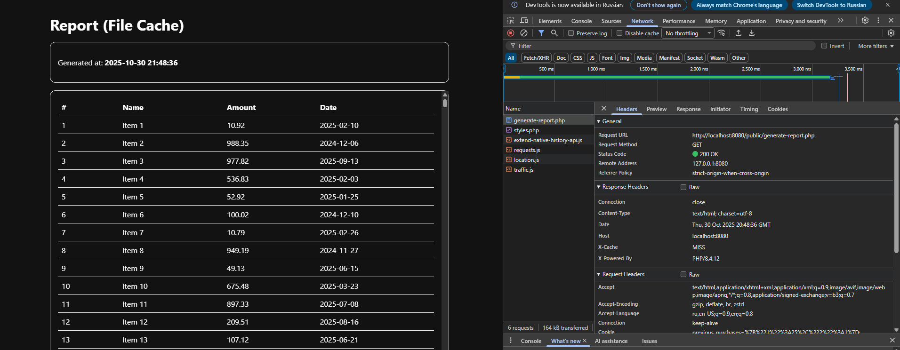
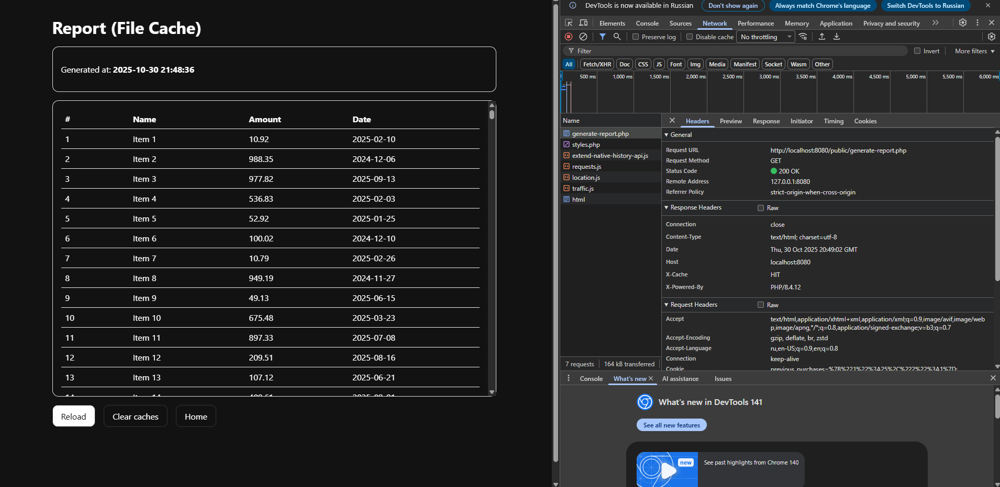
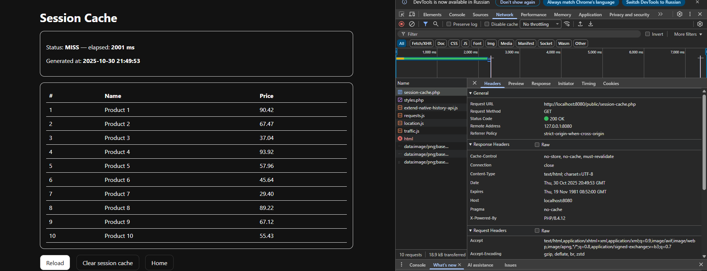
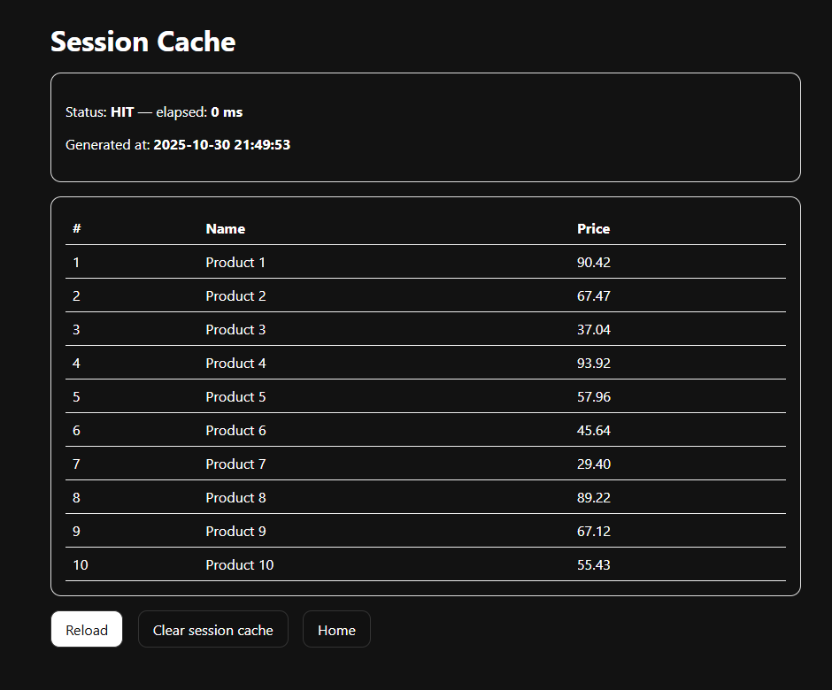

## Screenshots

### 1) Client cache — CSS/JS

**First request — 200 OK with cache headers** (`Cache-Control`, `ETag`, `Last-Modified`, `Expires`).

**Second request — served from cache.**

---

### 2) File cache — `generate-report.php`

**First load — `X-Cache: MISS` (~3s), cache file created.**

**Second load — `X-Cache: HIT` (fast), served from cache.**

---

### 3) Session cache — `session-cache.php`

**First visit — Status: MISS, about 2000 ms.**

**Second visit — Status: HIT, fast (same session).**

---

### 4) Static memoization — `static-cache.php`

**Within one HTTP request:** first call ~2000 ms, second call ~0 ms (cache only during render).

---

## Explanation

* **styles.php / app.php** return CSS/JS with `Cache-Control: public, max-age=86400`, `Expires +1 day`, `ETag`, `Last-Modified` and support 304.
* **generate-report.php** renders a heavy table and caches HTML to `cache/report.html` for 10 minutes; sets `X-Cache: HIT/MISS`.
* **session-cache.php** stores calculated data in `$_SESSION` for the current user/session.
* **static-cache.php** uses a `static` property to avoid repeated work inside the same request.
